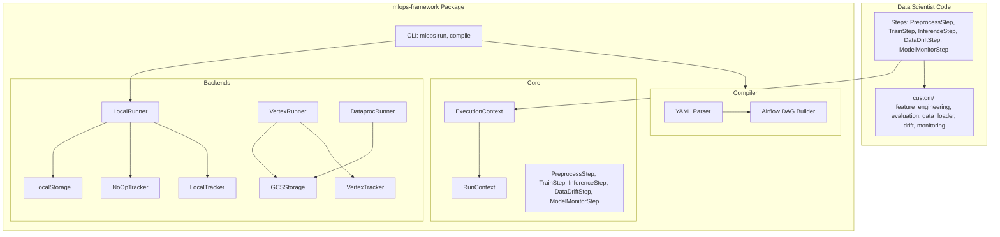
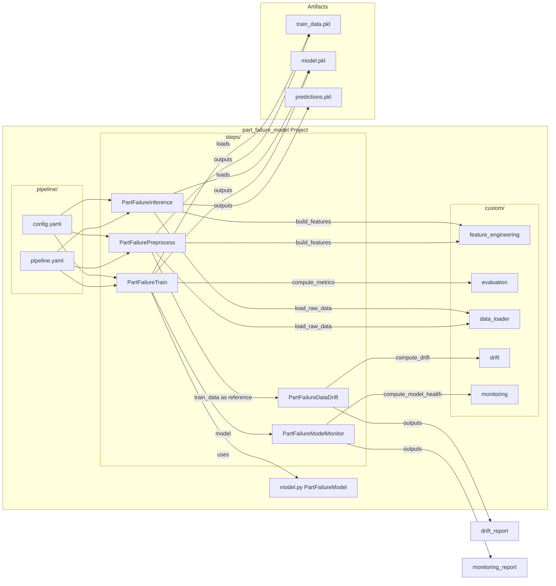
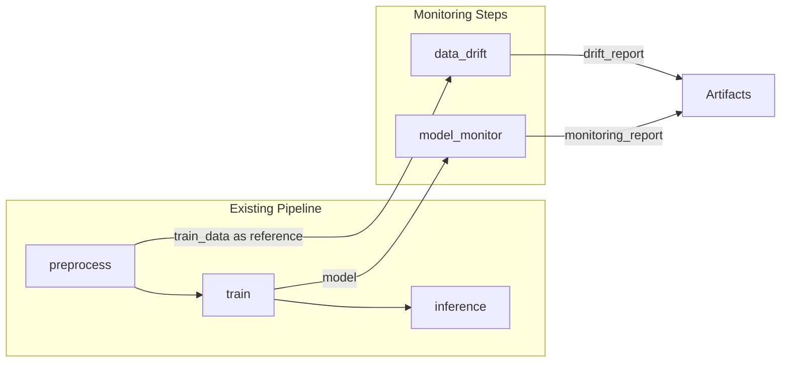
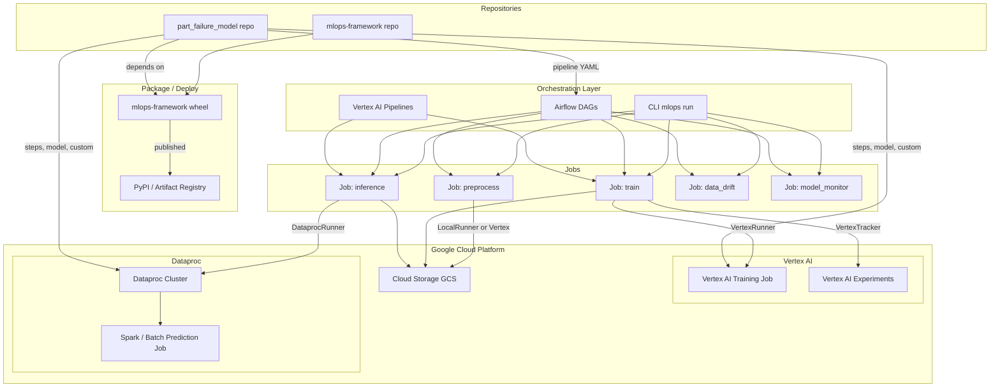
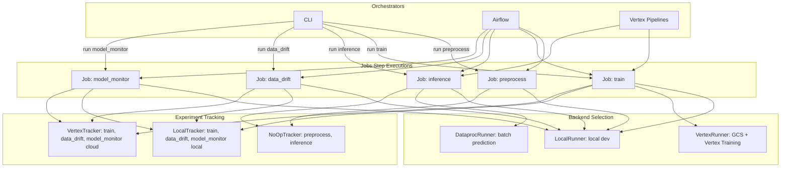
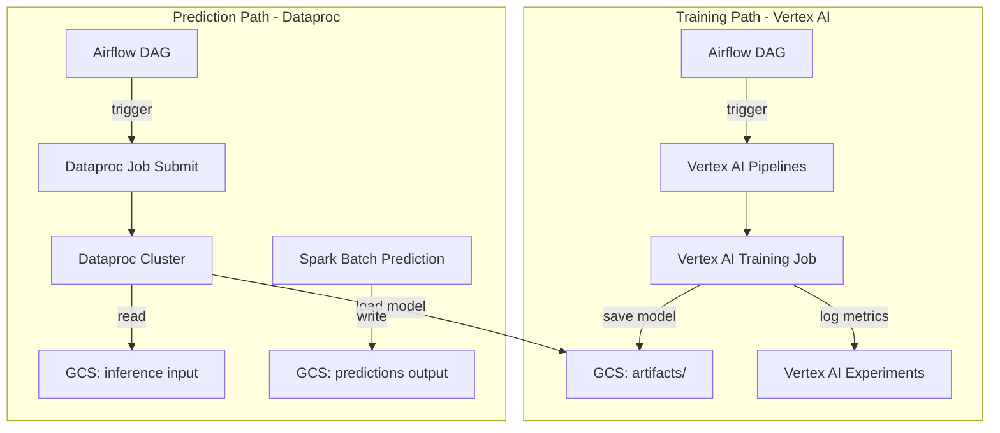
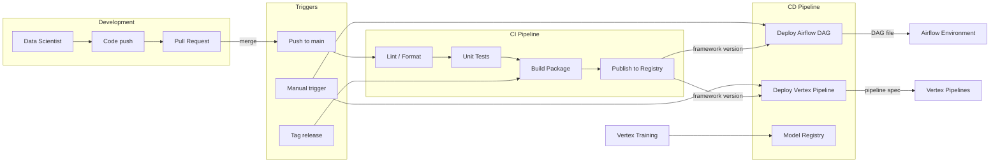

# MLOps Platform Architecture

Architecture diagrams for the MLOps framework, project model, orchestration, and CI/CD.

---

## 1. Framework Diagram

High-level structure of the MLOps framework library.

---

## 2. Project Model Diagram

Structure of a model project (e.g. part_failure_model) and data flow between steps.

---

## 2b. Monitoring Steps Data Flow

Data drift and model monitoring run alongside the main pipeline.

- **DataDriftStep**: Compares reference (training) vs current (production) distribution; outputs `drift_report` with PSI, max drift.
- **ModelMonitorStep**: Evaluates model on recent labeled data; outputs `monitoring_report` with accuracy, prediction stats.

---

## 3. Big Picture: Orchestration, Framework, Model Repo, Vertex AI, Dataproc

End-to-end view across repos, orchestration, and cloud services.

---

## 4. Orchestrator to Jobs Flow

How the orchestrator launches jobs and how jobs map to backends.

---

## 5. Vertex AI Training and Dataproc Prediction

Cloud execution paths for training and batch prediction.

---

## 6. CI/CD Diagram

Continuous integration and deployment pipeline.

---

## 7. Component Summary

| Component | Purpose |
|-----------|---------|
| **mlops-framework** | Library: steps, runners, tracking, storage, compiler |
| **part_failure_model** | Model project: pipeline, steps, custom modules |
| **Airflow** | Orchestrator: schedule and run jobs locally or on GCP |
| **Vertex AI Training** | Cloud training jobs with experiment tracking |
| **Dataproc** | Batch prediction at scale (Spark) |
| **GCS** | Artifact and model storage |
| **CI/CD** | Build, test, publish framework; deploy DAGs and pipelines |
