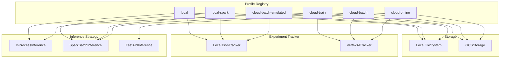
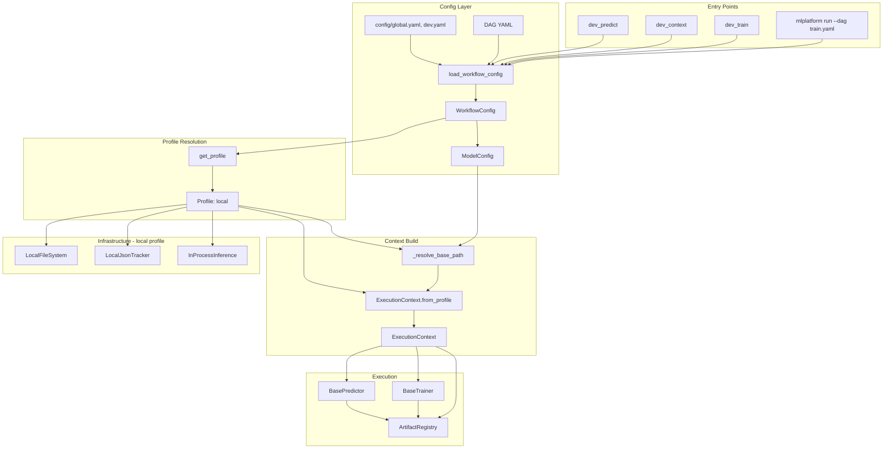
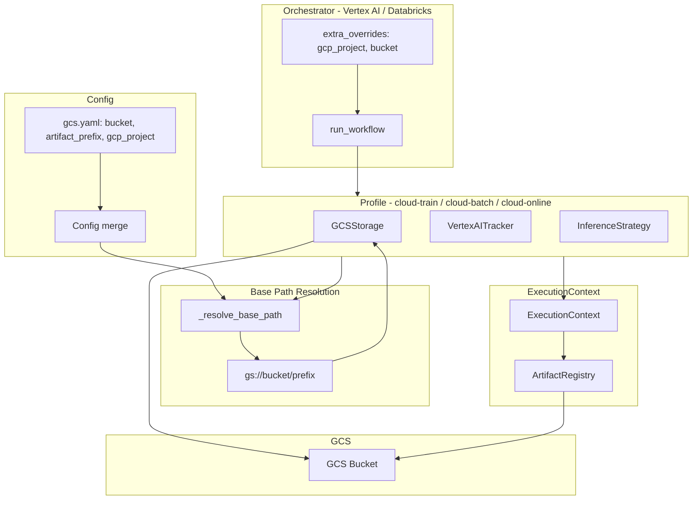
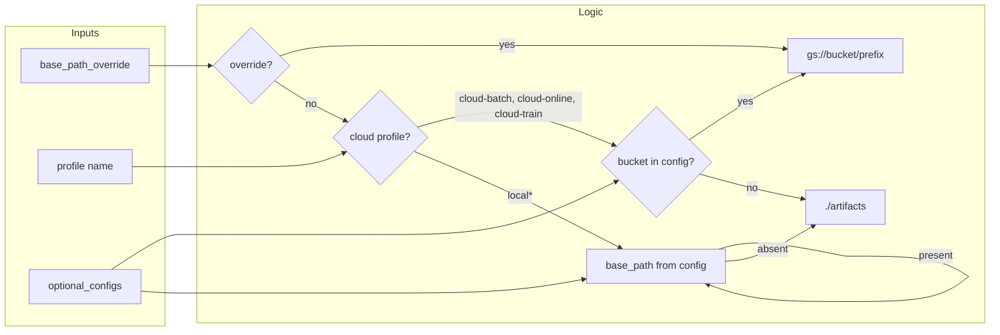
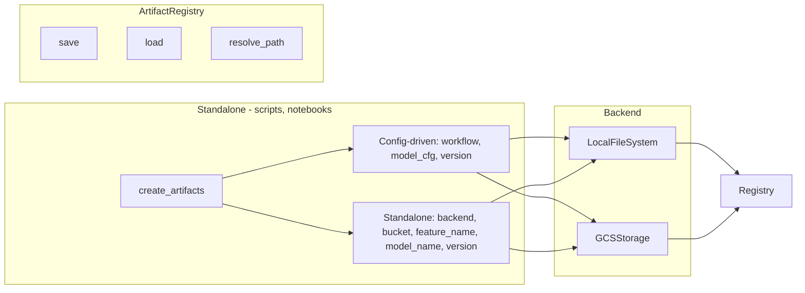
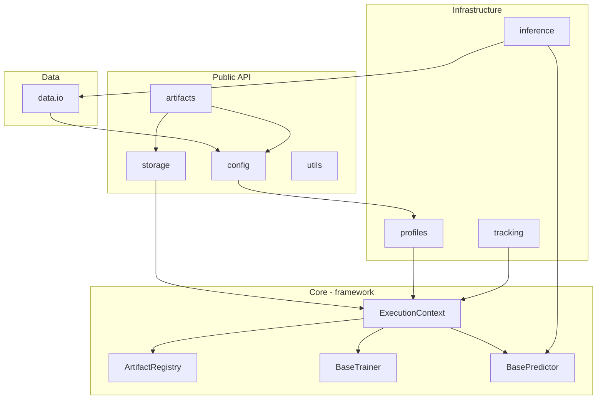

# MLPlatform Architecture

Architectural overview of the mlplatform framework: profiles, flows, and components.

---

## Quick Reference: Local vs Cloud

| Aspect | Local Development | Cloud |
|--------|-------------------|-------|
| **Storage** | `LocalFileSystem(base_path)` — e.g. `./artifacts` | `GCSStorage(gs://bucket/prefix)` |
| **Tracker** | `LocalJsonTracker` — JSON under base_path | `VertexAITracker` — Vertex AI Experiments |
| **Training** | `profile=local` → InProcess | `profile=cloud-train` → InProcess + GCS |
| **Prediction** | `profile=local` → InProcess (CSV/Parquet) | `profile=cloud-batch` → SparkBatch (Dataproc) |
| **Online serving** | N/A | `profile=cloud-online` → FastAPI |
| **Config** | `config/global.yaml`, `dev.yaml` — base_path, train_data_path | `config/gcs.yaml` — bucket, gcp_project |
| **Orchestrator injection** | Optional | `extra_overrides` — gcp_project, bucket |

---

## 1. Profile Matrix

A **Profile** bundles Storage, ExperimentTracker, and InferenceStrategy for an execution environment.



| Profile | Storage | Tracker | Inference | Use Case |
|---------|---------|---------|------------|----------|
| `local` | LocalFileSystem | LocalJsonTracker | InProcess | Dev: train/predict in-process, artifacts to disk |
| `local-spark` | LocalFileSystem | LocalJsonTracker | SparkBatch | Dev: Spark batch prediction locally |
| `cloud-batch-emulated` | LocalFileSystem | LocalJsonTracker | SparkBatch | Dev: Spark flow without GCS |
| `cloud-train` | GCSStorage | VertexAITracker | InProcess | Cloud: training on Vertex AI |
| `cloud-batch` | GCSStorage | VertexAITracker | SparkBatch | Cloud: batch prediction on Dataproc/Vertex |
| `cloud-online` | GCSStorage | VertexAITracker | FastAPI | Cloud: REST serving |

---

## 2. Local Development Flow



**Local flow summary:**
- **Storage**: `LocalFileSystem(base_path)` — e.g. `./artifacts` or `./dev_artifacts`
- **Tracker**: `LocalJsonTracker` — params/metrics to JSON under base_path
- **Artifacts**: `{base_path}/{feature}/{model}/{version}/model.pkl`
- **Data**: CSV/Parquet from `input_path` / `output_path` in config

---

## 3. Cloud Flow



**Cloud flow summary:**
- **Storage**: `GCSStorage(gs://bucket/prefix)` — project from `extra_overrides` or env
- **Tracker**: `VertexAITracker` — experiments in Vertex AI
- **Base path**: `gs://{bucket}/{artifact_prefix}` from config (`gcs.yaml`) or `extra_overrides`
- **Orchestrator** injects `gcp_project`, `bucket` via `extra_overrides` when config is not sufficient

---

## 4. Base Path Resolution



| Scenario | Result |
|----------|--------|
| `--base-path ./my_artifacts` | `./my_artifacts` |
| `profile=local`, config `base_path: ./dev_artifacts` | `./dev_artifacts` |
| `profile=cloud-train`, config `bucket: my-bucket`, `artifact_prefix: models` | `gs://my-bucket/models` |
| `profile=cloud-train`, no bucket | `./artifacts` (fallback) |

---

## 5. Training Flow (Detailed)

```mermaid
sequenceDiagram
    participant User
    participant Runner
    participant Config
    participant Profile
    participant Context
    participant Trainer
    participant Storage
    participant Tracker

    User->>Runner: run_workflow(dag_path, profile="local")
    Runner->>Config: load_workflow_config(dag_path)
    Config-->>Runner: WorkflowConfig, ModelConfig

    Runner->>Profile: get_profile("local")
    Profile-->>Runner: Profile(storage_factory, tracker_factory)

    Runner->>Context: _build_context(workflow, model_cfg, profile, ...)
    Context->>Profile: storage_factory(base_path, extra)
    Profile-->>Context: LocalFileSystem
    Context->>Profile: tracker_factory(base_path, extra)
    Profile-->>Context: LocalJsonTracker
    Context-->>Runner: ExecutionContext

    Runner->>Trainer: trainer.context = ctx; trainer.train()
    Trainer->>Storage: artifacts.save("model.pkl", model)
    Trainer->>Tracker: tracker.log_metrics(metrics)
    Trainer->>Tracker: tracker.log_params(params)
```

---

## 6. Prediction Flow by Inference Strategy

```mermaid
flowchart TB
    subgraph inprocess [InProcessInference - local, cloud-train]
        IP1[load_model]
        IP2[load_prediction_input]
        IP3[predict]
        IP4[write_prediction_output]
        IP1 --> IP2 --> IP3 --> IP4
    end

    subgraph spark [SparkBatchInference - local-spark, cloud-batch]
        S1[SparkSession]
        S2[Read CSV/Parquet/BigQuery]
        S3[mapInPandas: load_model + predict per partition]
        S4[Write Parquet/BigQuery]
        S1 --> S2 --> S3 --> S4
    end

    subgraph fastapi [FastAPIInference - cloud-online]
        F1[load_model]
        F2[Start FastAPI server]
        F3[POST /predict]
        F1 --> F2 --> F3
    end
```



| Strategy | Data source | Output | Used by |
|----------|-------------|--------|---------|
| InProcess | `input_path` CSV/Parquet or BigQuery | `output_path` or BigQuery | local, cloud-train |
| SparkBatch | `input_path` or BQ table | Parquet or BQ table | local-spark, cloud-batch |
| FastAPI | HTTP request body | HTTP response | cloud-online |

---

## 7. Standalone Artifacts (No Framework)



**Usage:**
```python
# Standalone local
artifacts = create_artifacts(
    backend="local",
    base_path="./artifacts",
    feature_name="demo",
    model_name="model",
    version="v1",
)

# Standalone GCS
artifacts = create_artifacts(
    backend="gcs",
    bucket="my-bucket",
    prefix="models",
    project="my-project",
    feature_name="demo",
    model_name="model",
    version="v1",
)
```

---

## 8. Component Dependency Overview



---

## 9. Config Profile Merge Flow

```mermaid
flowchart LR
    DAG[DAG YAML] --> Tasks[tasks with config: key]
    Tasks --> Names[config: global, dev]
    Names --> Load1[Load global.yaml]
    Load1 --> Load2[Load dev.yaml]
    Load2 --> Merge[Deep merge]
    Merge --> TaskMerge[Merge into task entry]
    TaskMerge --> ModelConfig[ModelConfig]
    ModelConfig --> OptionalConfigs[optional_configs]
```



Config profiles supply: `base_path`, `bucket`, `artifact_prefix`, `gcp_project`, `train_data_path`, `input_path`, `output_path`, etc.
