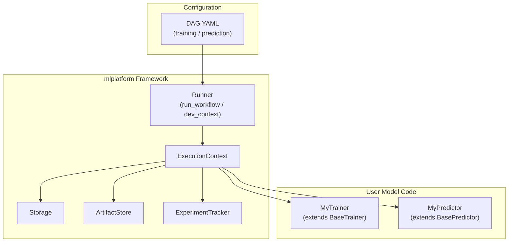
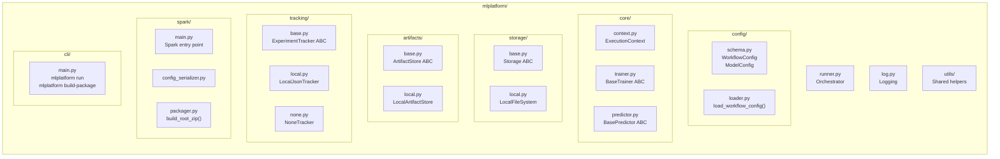
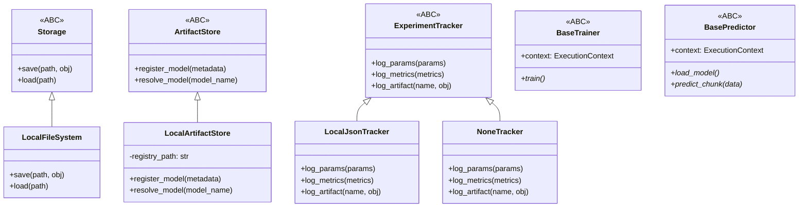
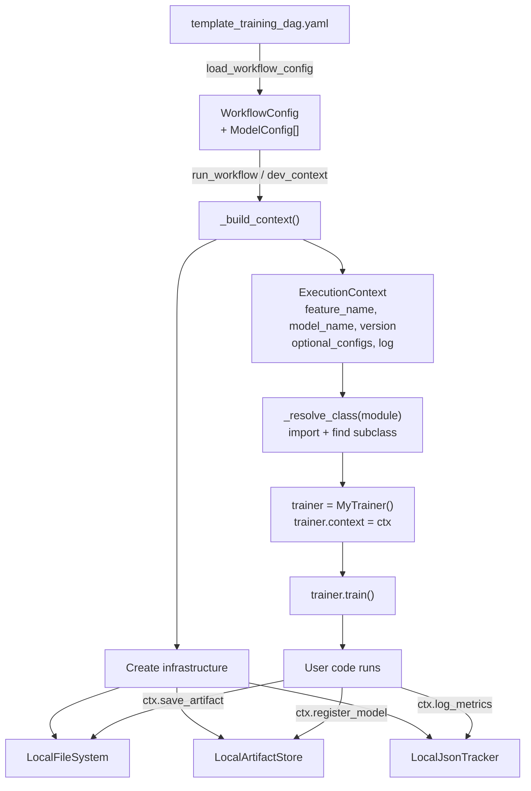
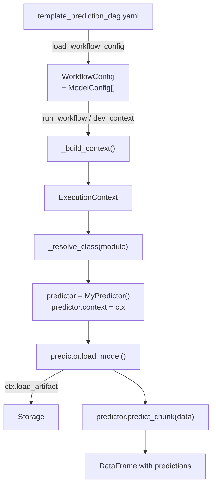
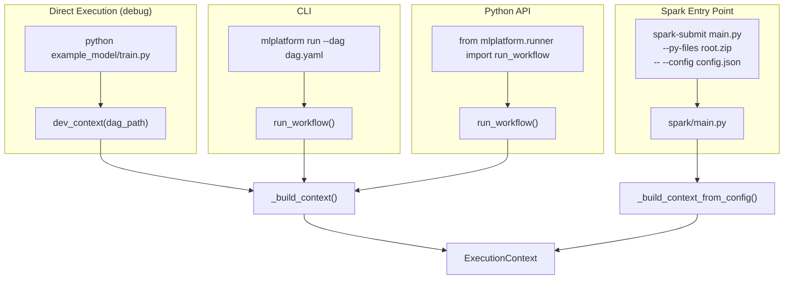
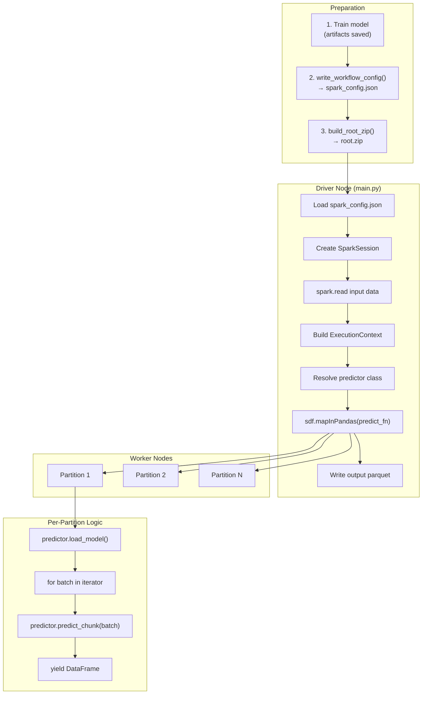
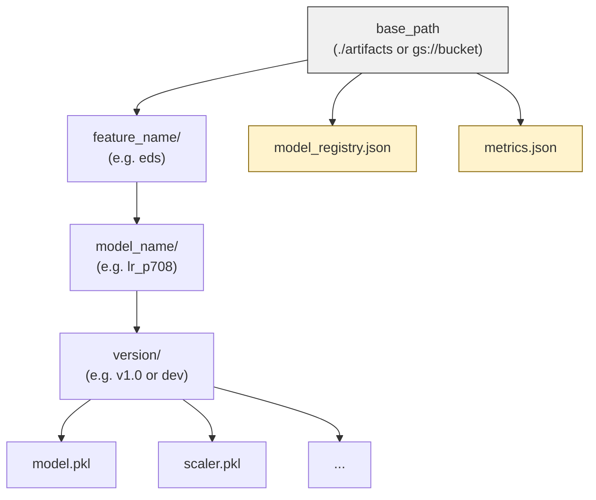
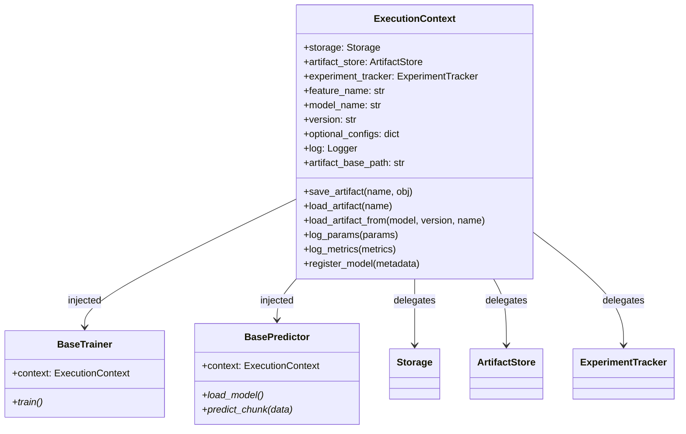
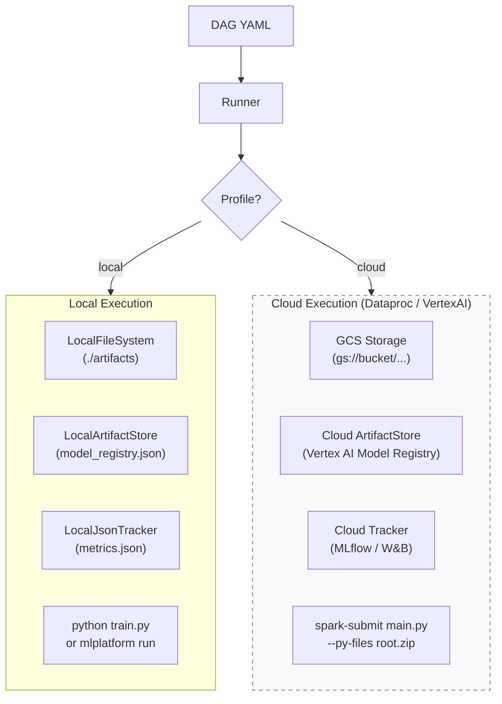

# ML Platform Framework — Architecture Diagrams

Mermaid diagrams at different abstraction levels to understand the framework.

---

## Level 1: High-Level Overview

Three layers: orchestration config, the framework, and user model code.

---

## Level 2: Module Map

Package layout showing every module and its role.

---

## Level 3: Pluggable Backend Hierarchy

Abstract base classes and their concrete implementations.

---

## Level 4: Training Data Flow

From DAG YAML through the runner to the user's trainer.

---

## Level 5: Prediction Data Flow

From DAG YAML through the runner to the user's predictor.

---

## Level 6: Entry Points

Three ways to run the framework.

---

## Level 7: Spark Distributed Prediction (mapInPandas)

How batch prediction works on a Spark cluster.

---

## Level 8: Artifact Layout

Where artifacts are stored on disk (or cloud storage).

---

## Level 9: ExecutionContext API

What the user's code interacts with.

---

## Level 10: Local vs Cloud Execution

Same framework code, different infrastructure.

> Dashed border: cloud backends are extension points, not yet implemented. The framework architecture supports them via the ABC interfaces.
