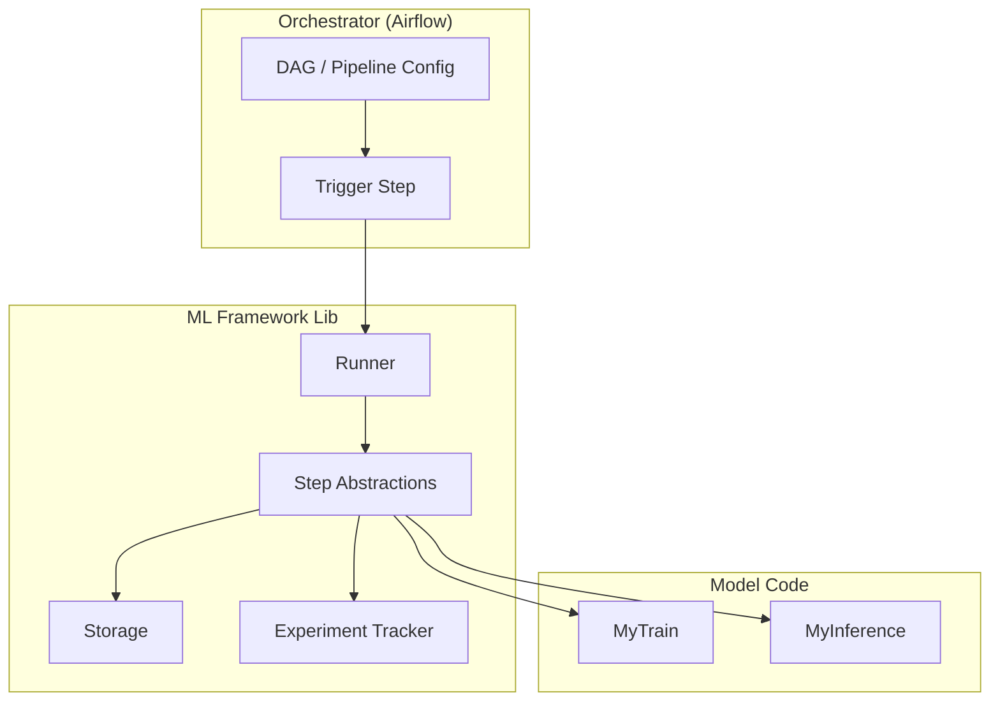
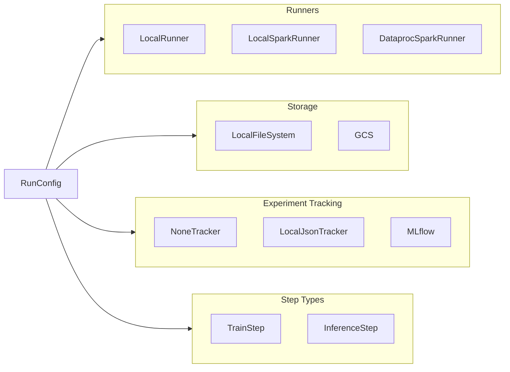
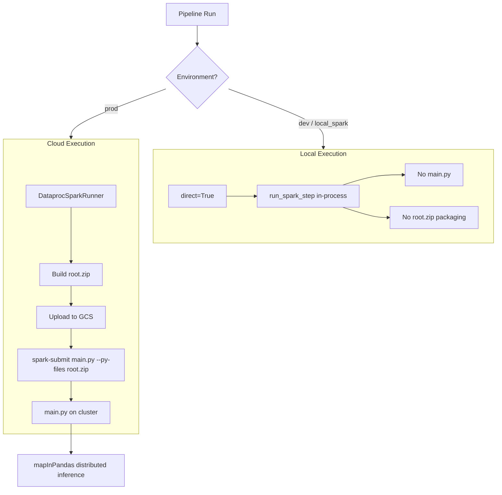
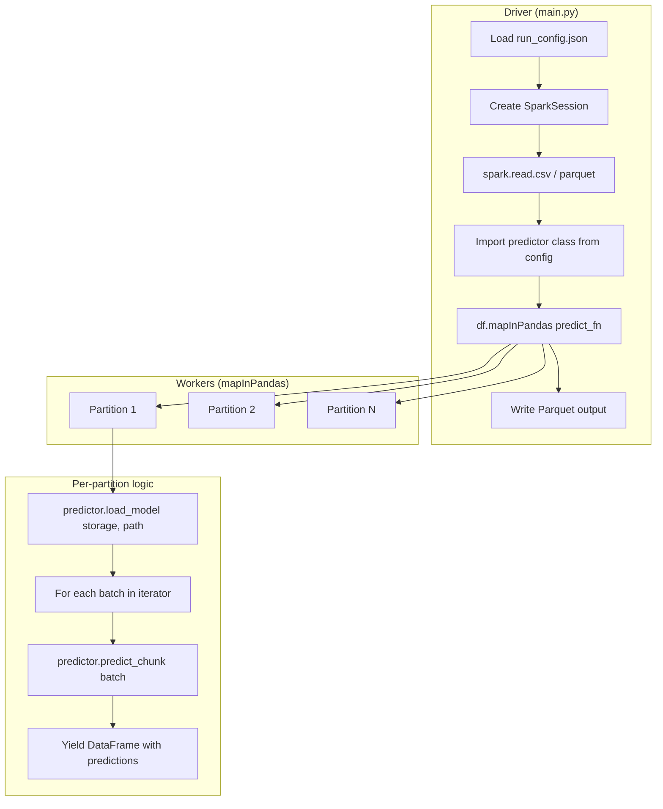
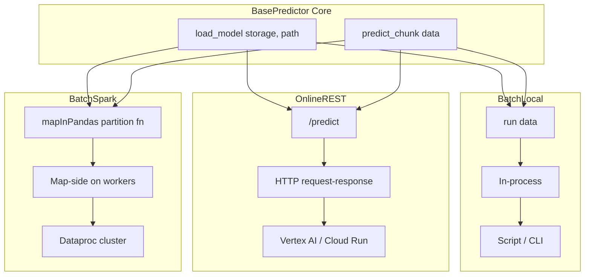
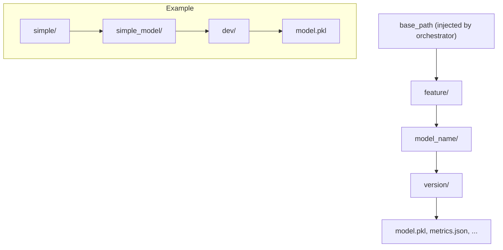
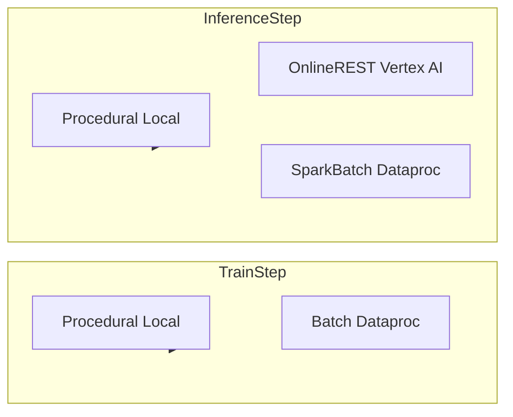

# ML Platform Framework — Architecture Diagrams

Diagrams at different abstraction levels to understand the framework.

---

## Level 1: Component Overview

High-level separation of responsibilities.



---

## Level 2: Primitives & Registry

Pluggable backends and how they connect.



---

## Level 3: Local vs Cloud Execution Paths

When and how execution happens.



---

## Level 4: Spark Inference Flow (mapInPandas)

How distributed prediction works on Dataproc.



---

## Level 5: Pipeline Data Flow

From config to step execution.

```mermaid
flowchart TB
    subgraph Config["Configuration"]
        DAG[DAG YAML train_infer.yaml]
        StepYAML[Step YAMLs train.yaml, inference.yaml]
        Env[env: dev | local_spark | prod]
    end

    subgraph Resolved["Resolved RunConfig"]
        StepConfig[StepConfig: name, type, module, class]
        EnvConfig[EnvConfig: runner, storage, etb, base_path]
    end

    subgraph Context["ExecutionContext"]
        Storage[Storage]
        ETB[ETB]
        Runner[Runner]
        RunConfig[RunConfig]
    end

    subgraph Execution["Execution"]
        Instantiate[Instantiate step class]
        Run[step.run context, **kwargs]
        Result[Result]
    end

    DAG --> StepYAML
    StepYAML --> Env
    Env --> StepConfig
    Env --> EnvConfig

    StepConfig --> RunConfig
    EnvConfig --> Context

    Context --> Instantiate
    Instantiate --> Run
    Run --> Result
```

---

## Level 6: Serving Modes (BasePredictor)

Same core logic, different invocation wrappers.



---

## Level 7: Artifact Hierarchy

Where artifacts live (Feature > Model > Version).



---

## Level 8: Step Types & Execution Modes


