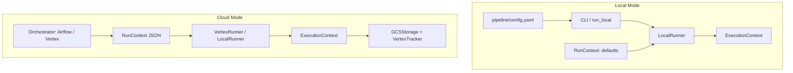

# MLOps Framework

A minimal but extensible MLOps framework that standardizes how Data Scientists build, train, evaluate, and deploy ML models while abstracting infrastructure concerns.

## Features

- **Standardized Workflows**: Inheritance-based API similar to PyTorch's `nn.Module`
- **Local-First Development**: Run locally without cloud access
- **Experiment Tracking**: Support for local filesystem and MLflow backends
- **Artifact Management**: Versioned storage with semantic artifact types
- **Configuration-Driven**: YAML-based configuration for runtime behavior
- **Model-Agnostic**: Works with any ML framework (scikit-learn, PyTorch, TensorFlow, etc.)
- **Training & Inference**: Same codebase supports both training and inference pipelines

## Architecture

See [ARCHITECTURE.md](ARCHITECTURE.md) for detailed diagrams: framework, project model, big picture with Vertex AI and Dataproc, and CI/CD.

```
┌─────────────────────────────────────────────────────────┐
│              Data Scientist Code                         │
│  (TrainingPipeline, InferencePipeline implementations)  │
└────────────────────┬────────────────────────────────────┘
                     │
┌────────────────────▼────────────────────────────────────┐
│              Core Framework                              │
│  ┌──────────┐  ┌──────────┐  ┌──────────┐             │
│  │ Runtime  │  │ Tracking │  │ Artifacts│             │
│  └──────────┘  └──────────┘  └──────────┘             │
└────────────────────┬────────────────────────────────────┘
                     │
┌────────────────────▼────────────────────────────────────┐
│              Backends                                    │
│  ┌──────────────┐  ┌──────────────┐                    │
│  │ Local FS     │  │ MLflow       │                    │
│  │ Tracking     │  │ Tracking     │                    │
│  └──────────────┘  └──────────────┘                    │
└─────────────────────────────────────────────────────────┘
```

### Config Flow: Local vs Cloud



- **Local**: Config from `pipeline/config.yaml`; RunContext derived from defaults; `tracking_enabled=False` unless `--tracking`.
- **Cloud**: Config passed via orchestrator (env, `op_kwargs`, `MLOPS_RUN_CONTEXT`); RunContext filled by orchestrator; `tracking_enabled=True` for train steps.

## Quick Start

### Installation

The framework is a library. Install it in your project:

```bash
pip install mlops-framework
# or from source: pip install -e .
```

### Project Setup (Standalone Repo)

Framework and projects live in **different repositories**. Your project structure:

```
your-project/                 # Project root = cwd when running
├── config.yaml
├── pipeline.yaml
├── requirements.txt          # mlops-framework>=0.1.0, pandas, scikit-learn, ...
├── run.py                    # Optional: entry point for local dev
├── steps/
│   ├── __init__.py
│   ├── preprocess.py
│   ├── train.py
│   └── inference.py
├── model.py                  # Shared model code
└── data/
```

### pipeline.yaml Schema

```yaml
pipeline:
  name: my_pipeline

steps:
  - id: preprocess
    class: steps.preprocess.PartFailurePreprocess
  - id: train
    class: steps.train.PartFailureTrain
    depends_on: [preprocess]
  - id: inference
    class: steps.inference.PartFailureInference
    depends_on: [train]
```

Class paths are project-relative (e.g. `steps.preprocess.ChurnPreprocess` = `steps/preprocess.py` with class `ChurnPreprocess`).

### Commands Reference

| Command | Description |
|---------|-------------|
| `mlops run <step> [--env dev\|qa\|prod] [--tracking] [--tracking-backend local\|vertex]` | Run a pipeline step locally |
| `mlops compile pipeline/pipeline.yaml -o dags/xxx.py` | Compile pipeline to Airflow DAG |
| `python run.py <step> [--env dev\|qa\|prod]` | Project entry point for local dev |
| `python -m steps.<step>` | Run step module directly (e.g. `steps.preprocess`) |

### Running Locally (Zero Config)

```bash
cd your-project
mlops run preprocess
mlops run train
mlops run inference
```

Defaults: `./artifacts`, `./runs`, config from `pipeline/config.yaml`. No flags required.

Enable experiment tracking (persist metrics/params to `./runs`):

```bash
mlops run train --tracking
```

### Experiment Tracking

- **Local**: Off by default. Use `--tracking` or `--tracking-backend local` to persist to `./runs/{run_id}/`.
- **Vertex**: Use `--tracking-backend vertex` (with GCP creds) for Vertex AI Experiments.
- **Cloud**: On by default for train steps when `base_path` is `gs://...`.

### Direct Debugging with run_local

Run a step file directly for debugging (no pipeline.yaml needed):

```python
# steps/preprocess.py
from mlops_framework import PreprocessStep, run_local

class ChurnPreprocess(PreprocessStep):
    def run(self):
        # ... your logic

if __name__ == "__main__":
    run_local(ChurnPreprocess)
```

Then: `python steps/preprocess.py`

---

## Legacy API (Deprecated)

### Basic Usage

#### 1. Create a Training Pipeline

```python
from mlops_framework import TrainingPipeline
from mlops_framework.artifacts.types import ArtifactType

class MyTrainingPipeline(TrainingPipeline):
    def load_data(self, *args, **kwargs):
        # Load your training data
        return X_train, y_train
    
    def train(self, data, *args, **kwargs):
        # Train your model
        X_train, y_train = data
        model = MyModel()
        model.fit(X_train, y_train)
        return model
    
    def evaluate(self, model, data, *args, **kwargs):
        # Evaluate your model
        X_val, y_val = data
        predictions = model.predict(X_val)
        return {
            "accuracy": accuracy_score(y_val, predictions),
            "f1_score": f1_score(y_val, predictions)
        }
```

#### 2. Create a Configuration File

`config.yaml`:
```yaml
runtime:
  mode: local_with_tracking
  tracking_backend: local

tracking:
  local:
    base_path: ./runs

artifacts:
  base_path: ./artifacts
```

#### 3. Run Training

```python
pipeline = MyTrainingPipeline(config_path="config.yaml")
results = pipeline.run()
print(f"Run ID: {results['run_id']}")
print(f"Metrics: {results['metrics']}")
```

#### 4. Create an Inference Pipeline

```python
from mlops_framework import InferencePipeline

class MyInferencePipeline(InferencePipeline):
    def load_data(self, *args, **kwargs):
        # Load inference data
        return X_inference
    
    def predict(self, model, data, *args, **kwargs):
        # Generate predictions
        return model.predict(data)
```

#### 5. Run Inference

```python
# Batch inference
pipeline = MyInferencePipeline(run_id="run_20240101_120000_123456")
predictions = pipeline.run_batch()

# Online inference (single prediction)
prediction = pipeline.run_online(single_input)
```

## Configuration

The framework is configured via YAML files. Key configuration options:

### Runtime Modes

- `local`: No tracking, minimal overhead
- `local_with_tracking`: Full tracking and artifact management
- `cloud`: Stub for future cloud execution

### Tracking Backends

- `local`: Filesystem-based tracking (JSON files)
- `mlflow`: MLflow tracking (requires MLflow installation)

### Example Configuration

```yaml
runtime:
  mode: local_with_tracking
  tracking_backend: mlflow
  run_name: null  # Auto-generated if null

tracking:
  local:
    base_path: ./runs
  mlflow:
    tracking_uri: ./mlruns
    experiment_name: default

artifacts:
  base_path: ./artifacts
```

## Core Concepts

### TrainingPipeline

Base class for training workflows. Inherit from this and implement:
- `load_data()`: Load training data
- `train()`: Train the model
- `evaluate()`: Evaluate the model

The framework handles:
- Parameter and metric logging
- Artifact saving
- Run ID generation
- Tracking backend integration

### InferencePipeline

Base class for inference workflows. Inherit from this and implement:
- `load_data()`: Load inference data
- `predict()`: Generate predictions

The framework handles:
- Model loading from previous runs
- Batch and online inference modes

### ArtifactManager

Manages versioned artifact storage with semantic types:
- `ArtifactType.MODEL`: Trained models
- `ArtifactType.FEATURES`: Feature lists
- `ArtifactType.SCALER`: Preprocessing scalers
- `ArtifactType.ENCODER`: Feature encoders
- `ArtifactType.PLOT`: Visualization plots
- `ArtifactType.METADATA`: JSON metadata

### TrackingBackend

Abstract interface for experiment tracking. Implementations:
- `LocalTrackingBackend`: Filesystem-based
- `MLflowTrackingBackend`: MLflow integration (optional)

## Example Project

See `projects/part_failure_model/` for a complete example (template for a standalone project repo):
- Part-failure classification model (Random Forest)
- Step-based pipeline (preprocess, train, inference)
- Custom modules (`custom/`) for business logic: feature_engineering, evaluation, data_loader
- pipeline.yaml, config.yaml
- run_local for direct debugging

Run the example (from project root):
```bash
cd projects/part_failure_model
mlops run preprocess
mlops run train
mlops run inference
# Or direct debugging:
python -m steps.preprocess
```

## Extension Points

### Custom Tracking Backend

Implement the `TrackingBackend` interface:

```python
from mlops_framework.tracking.interface import TrackingBackend

class MyTrackingBackend(TrackingBackend):
    def log_param(self, name, value):
        # Your implementation
        pass
    
    # Implement other required methods...
```

### Custom Runtime Mode

Extend the `Runtime` class to add new execution modes (e.g., cloud execution).

### Custom Artifact Types

Extend `ArtifactType` enum in `mlops_framework/artifacts/types.py`.

## Framework Structure

The framework lives in `mlops_framework/` (the package directory). This directory is the framework repo root:

```
mlops_framework/           # Framework repo root (package directory)
├── setup.py
├── README.md
└── mlops_framework/       # Python package
    ├── core/              # BaseStep, ExecutionContext, step types
    ├── backends/          # storage, tracking, execution runners
    ├── compiler/          # YAML -> Airflow DAG
    ├── cli/               # mlops run, mlops compile
    └── ...
```

**Install from package directory:**
```bash
cd mlops_framework
pip install -e .
```

Projects (separate repos) depend on `mlops-framework` and run from their own root.

## Requirements

### Base Dependencies

- Python >= 3.7
- PyYAML

### Optional Dependencies

- MLflow (for MLflow tracking backend)
- scikit-learn, pandas, numpy (for example project)

## Design Philosophy

- **Opinionated but Flexible**: Provides structure while allowing customization
- **Minimal Boilerplate**: Data Scientists focus on ML logic, not infrastructure
- **Local-First**: Develop and test locally before moving to cloud
- **Extensible**: Easy to add new backends, runtimes, and artifact types

## Future Enhancements

- Cloud execution modes (Vertex AI, Dataproc)
- Kubernetes integration
- CI/CD pipeline templates
- Model serving endpoints
- Data validation framework
- Feature store integration

## License

MIT
